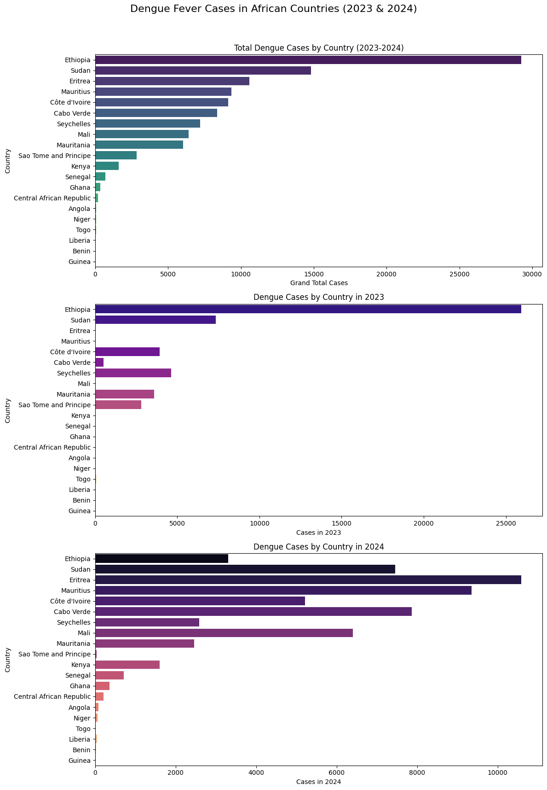
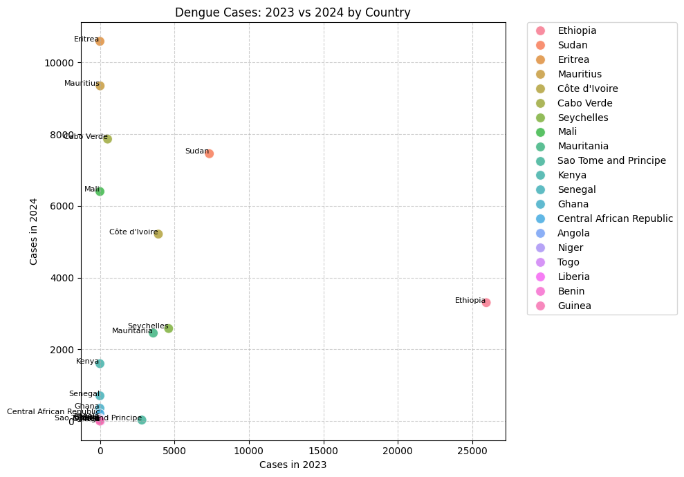

# Dengue Fever Prediction Project

## Mission and Problem Statement

The global incidence of dengue fever is rapidly increasing, with millions of cases reported annually, placing immense pressure on public health systems. African countries, in particular, are experiencing a significant surge in cases, highlighting an urgent need for predictive tools to anticipate and mitigate outbreaks. This project directly addresses this critical challenge.

Our mission is to develop a robust machine learning model that predicts dengue fever incidence, specifically forecasting 2024 cases based on 2023 data for various African nations. Given the well-documented link between increasing global temperatures and the expansion of mosquito-borne diseases like dengue into previously unaffected areas, this model aims to provide crucial foresight into year-over-year trends. By offering predictive insights, this project supports proactive public health interventions and resource allocation, ultimately contributing to better preparedness and more effective control strategies against future dengue outbreaks across the continent.


## Publicly Available API Endpoint

Our machine learning model is accessible via a robust FastAPI web API.
* **API Endpoint:** `https://dengue-prediction-api-agbajecity.onrender.com/predict` (POST request)
* **Swagger UI Documentation:** Explore and test the API interactively at:
    `https://dengue-prediction-api-agbajecity.onrender.com/docs`

## Video Demo

A comprehensive video demonstration of this project is available on YouTube:

* Watch the Demo on YouTube on this embedded link here

---

## Project Overview

### Dataset Description and Source

**Description:**
The dataset used is `Data on rise of fever in Africa - Dataset.csv`, containing dengue fever case numbers for various African countries for 2023 and 2024 (total cases per year and grand total).

**Source:**
This dataset is derived from reported cases by the World Health Organization (WHO) as provided in the initial project brief.

### Data Visualizations

To understand data characteristics and trends, the following meaningful visualizations were created:

1.  **Variable Distributions (Bar Plots):** Showcasing total dengue cases per country and annual distributions (2023, 2024), highlighting burden and year-over-year changes.
    
    
    

2.  **Relationship between Variables (Scatter Plot):** Illustrating the correlation between 2023 and 2024 dengue cases, revealing linearity and outlier outbreaks relevant to model fitting.
    

### Machine Learning Model Implementation

The project implements and compares three regression models for 2024 dengue case prediction:

* **SGDRegressor (Linear Regression):** Demonstrates a linear relationship and loss curve.
* **DecisionTreeRegressor:** A non-linear comparison model.
* **RandomForestRegressor:** An ensemble method, selected as the best-performing model (based on R-squared), saved for the API.

### API Endpoint Details

The API exposes the best-performing model for predictions:

* **Endpoint Structure:** POST request to `/predict`.
* **CORS Middleware:** Implemented to enable cross-origin requests.
* **Input Constraints:** Variables are strongly typed (`float`) and include range constraints (`gt=0`, `le=50000`) using Pydantic's `BaseModel` for robust data validation.

---

## **How to Run the Mobile App**

To run the Flutter mobile application and interact with the deployed API:

1.  **Prerequisites:**
    * Ensure you have the Flutter SDK installed on your local machine.
    * You have VS Code (or Android Studio) with the Flutter/Dart extensions.
    * You have an Android emulator/simulator or a physical device set up (`flutter doctor` should report no issues).

2.  **Clone the Repository:**
    * Open your terminal/command prompt.
    * Navigate to where you want to store the project.
    * Clone this GitHub repository:
        ```bash
        git clone [https://github.com/AgbajeCity/dengue-api-render.git](https://github.com/AgbajeCity/dengue-api-render.git)
        ```
    * Navigate into the cloned repository:
        ```bash
        cd dengue-api-render
        ```

3.  **Navigate to the Flutter App Directory:**
    * The Flutter app source code is located in the `summative/FlutterApp/` directory.
    * Change into this directory:
        ```bash
        cd summative/FlutterApp/dengue_prediction_app
        ```
        *(Note: Replace `dengue_prediction_app` if you named your Flutter project differently.)*

4.  **Install Flutter Dependencies:**
    * While in the `summative/FlutterApp/dengue_prediction_app` directory, run:
        ```bash
        flutter pub get
        ```
        This will download all necessary Dart and Flutter packages (including `http`).

5.  **Launch the App:**
    * Ensure an Android emulator is running, an iOS simulator is active (macOS), or a physical mobile device is connected and recognized by Flutter.
    * In the terminal (still in `summative/FlutterApp/dengue_prediction_app`), run:
        ```bash
        flutter run
        ```
    * The app will compile and launch on your selected device/emulator. You can then enter 2023 case values, click "Predict," and see predictions from the deployed API.
